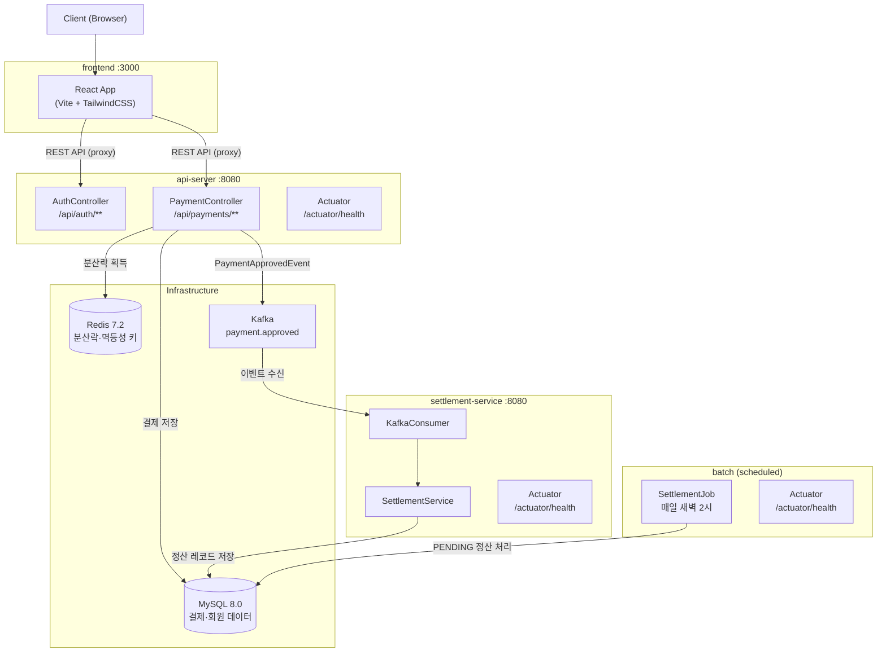
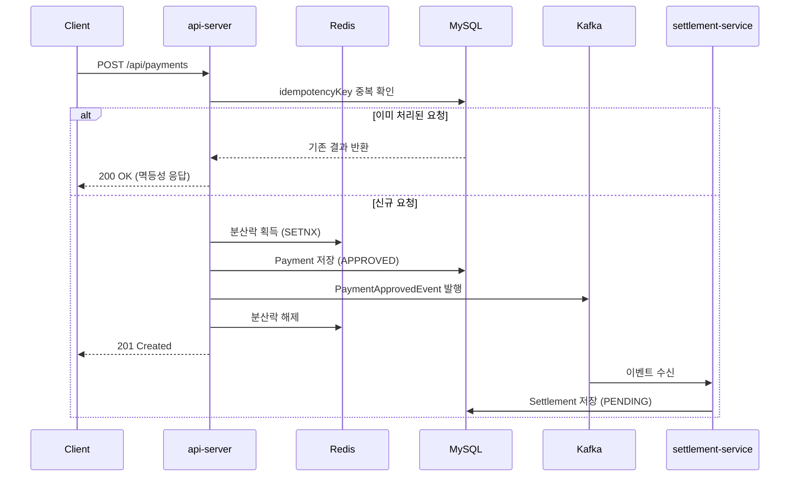

# 💳 Payment Platform

결제/정산 도메인의 백엔드 시스템을 직접 설계하고 구현한 사이드 프로젝트입니다.
실무에서 경험한 결제 시스템의 복잡한 비즈니스 로직을 바탕으로,
안정성·확장성·운영 가능성을 고려한 아키텍처를 목표로 합니다.


## 🛠 Tech Stack

| 분류 | 기술 |
|---|---|
| Backend | Java 21, Spring Boot 3.x, Spring Data JPA, Spring Batch |
| Frontend | React 18, Vite, TailwindCSS |
| Database | MySQL 8.0, Redis 7.2 |
| Messaging | Apache Kafka |
| Infra | Docker, Kubernetes (Docker Desktop) |
| CI/CD | GitHub Actions |
| Test | JUnit5, Mockito, H2, Testcontainers |

## 🏗 Architecture



### 결제 흐름



## 📦 Module Structure

```
payment-platform/
├── api-server/          # 결제 API 서버 (Spring Boot)
├── settlement-service/  # 정산 서비스 (Kafka Consumer)
├── batch/               # 배치 정산 처리 (Spring Batch)
├── frontend/            # 테스트 UI (React + Vite)
├── k8s/                 # 쿠버네티스 매니페스트
│   ├── api-server/
│   ├── settlement-service/
│   ├── batch/
│   ├── mysql/
│   ├── redis/
│   ├── kafka/
│   ├── zookeeper/
│   ├── configmap.yaml
│   └── secret.yaml
├── infra/               # Docker Compose (로컬 개발용)
├── deploy.sh            # k8s 빌드 & 배포 스크립트
└── teardown.sh          # k8s 리소스 전체 제거 스크립트
```

## 🔑 Key Features

- **결제 처리**: 결제 요청/승인/취소 REST API
- **중복 결제 방지**: Redis 분산락을 활용한 멱등성 보장
- **이벤트 기반 정산**: Kafka를 통한 결제 이벤트 발행/구독
- **배치 정산**: Spring Batch를 활용한 일별 정산 처리 (매일 새벽 2시)
- **인증**: JWT 기반 가맹점/어드민 권한 분리
- **쿠버네티스 배포**: 전체 서비스를 단일 스크립트로 k8s 클러스터에 배포
- **테스트 UI**: React 프론트엔드로 API 전체 흐름 직접 테스트 가능

## 📌 API 명세

### 인증

| Method | URL | 설명 | 인증 |
|--------|-----|------|------|
| POST | `/api/auth/signup` | 가맹점 회원가입 | 불필요 |
| POST | `/api/auth/login` | 로그인 (JWT 발급) | 불필요 |

**회원가입 요청**
```json
POST /api/auth/signup
{
  "email": "merchant@example.com",
  "password": "password123",
  "name": "홍길동"
}
```

**로그인 응답**
```json
{
  "accessToken": "eyJhbGciOiJIUzI1NiJ9...",
  "memberId": 1,
  "email": "merchant@example.com",
  "role": "MERCHANT"
}
```

### 결제

> 모든 결제 API는 `Authorization: Bearer {token}` 헤더 필요

| Method | URL | 설명 |
|--------|-----|------|
| POST | `/api/payments` | 결제 요청 |
| GET | `/api/payments` | 결제 목록 조회 (페이징·상태 필터) |
| GET | `/api/payments/{paymentId}` | 결제 단건 조회 |
| DELETE | `/api/payments/{paymentId}` | 결제 취소 |

**결제 요청**
```json
POST /api/payments
{
  "idempotencyKey": "order-20240101-001",
  "amount": 10000,
  "currency": "KRW",
  "orderName": "상품명"
}
```

**결제 응답**
```json
{
  "paymentId": 1,
  "idempotencyKey": "order-20240101-001",
  "amount": 10000,
  "currency": "KRW",
  "orderName": "상품명",
  "status": "APPROVED",
  "createdAt": "2024-01-01T10:00:00"
}
```

**결제 상태 흐름**
```
PENDING → APPROVED → CANCELLED
        ↘ FAILED
```

### 헬스체크

| URL | 설명 |
|-----|------|
| `GET /actuator/health` | 서비스 상태 및 DB/Redis 연결 확인 |
| `GET /actuator/info` | 앱 버전·설명 정보 |

## 🚀 Getting Started

### 사전 준비

- Java 21+
- Docker Desktop (Kubernetes 활성화)
- Node.js 18+

### 방법 1 — 쿠버네티스 배포 (권장)

```bash
# 전체 빌드 & 배포 (이미지 빌드 → 레지스트리 푸시 → k8s 적용)
bash deploy.sh

# 코드 변경 없이 k8s 설정만 재적용
bash deploy.sh --no-build

# 전체 제거
bash teardown.sh
```

배포 완료 후 api-server 접근:

```bash
kubectl port-forward svc/api-server 8080:8080
```

### 방법 2 — Docker Compose (로컬 개발)

```bash
# 1. 인프라 실행 (MySQL, Redis, Kafka, Zookeeper)
cd infra && docker-compose up -d

# 2. 서비스 실행
./gradlew :api-server:bootRun
./gradlew :settlement-service:bootRun
./gradlew :batch:bootRun
```

### 프론트엔드 실행

```bash
# api-server port-forward 먼저 실행 (별도 터미널)
kubectl port-forward svc/api-server 8080:8080

# 프론트엔드 시작
cd frontend
npm install
npm run dev
# → http://localhost:3000
```

| 경로 | 설명 |
|------|------|
| `/signup` | 회원가입 |
| `/login` | 로그인 |
| `/payments` | 결제 목록 (상태 필터, 페이징) |
| `/payments/new` | 결제 생성 |
| `/payments/:id` | 결제 상세 및 취소 |

### 테스트 실행

```bash
# 전체 테스트 (Docker 실행 필요 — Testcontainers 사용)
./gradlew test

# 모듈별 테스트
./gradlew :api-server:test
./gradlew :settlement-service:test
./gradlew :batch:test
```

### Kafka → 정산 흐름 확인

결제 생성 후 아래 명령으로 이벤트 전달을 확인합니다.

```bash
# api-server: Kafka 이벤트 발행 로그
kubectl logs -l app=api-server --tail=30

# settlement-service: 이벤트 수신 및 정산 저장 로그
kubectl logs -l app=settlement-service --tail=30

# MySQL: settlements 테이블 직접 조회
kubectl exec -it mysql-0 -- mysql -u payment -ppayment1234 payment_db \
  -e "SELECT id, payment_id, order_name, amount, status, created_at FROM settlements ORDER BY id DESC LIMIT 10\G"
```

## 📝 설계 기록 (ADR)

프로젝트를 진행하며 내린 기술적 의사결정을 기록합니다.

- [Redis 분산락을 선택한 이유](docs/adr/001-redis-distributed-lock.md)
- [Kafka vs RabbitMQ 비교 및 선택 근거](docs/adr/002-kafka-vs-rabbitmq.md)
- [멀티모듈 구조 설계 이유](docs/adr/003-multi-module-structure.md)
- [MDC 기반 요청 추적 (Trace ID)](docs/adr/004-mdc-trace-id.md)
- [JWT 기반 인증 방식 선택](docs/adr/005-jwt-authentication.md)
- [Testcontainers 선택 (Mock vs 실제 컨테이너)](docs/adr/006-testcontainers.md)

## 🙋 Author

박윤성 | Backend Engineer
- GitHub: [@Yunisung](https://github.com/Yunisung)
- Email: pys0102@gmail.com
